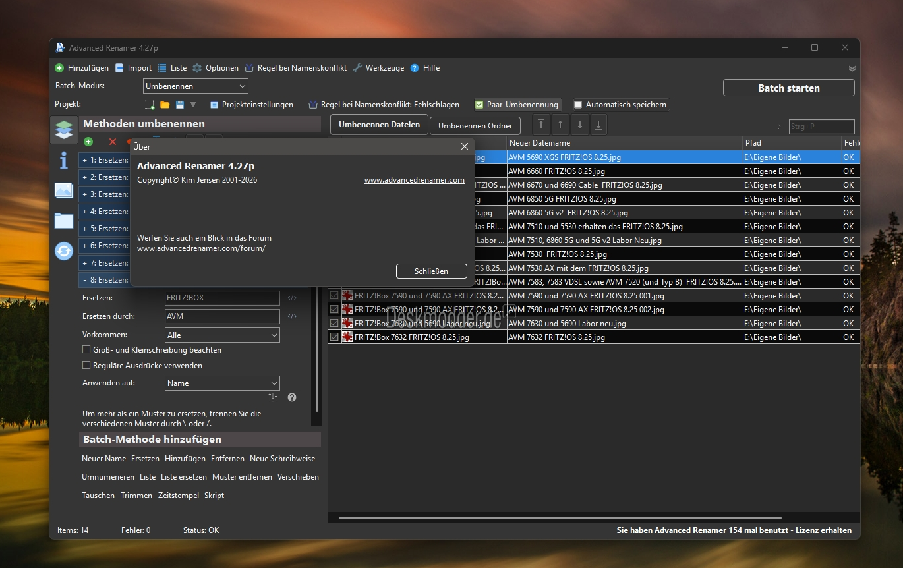
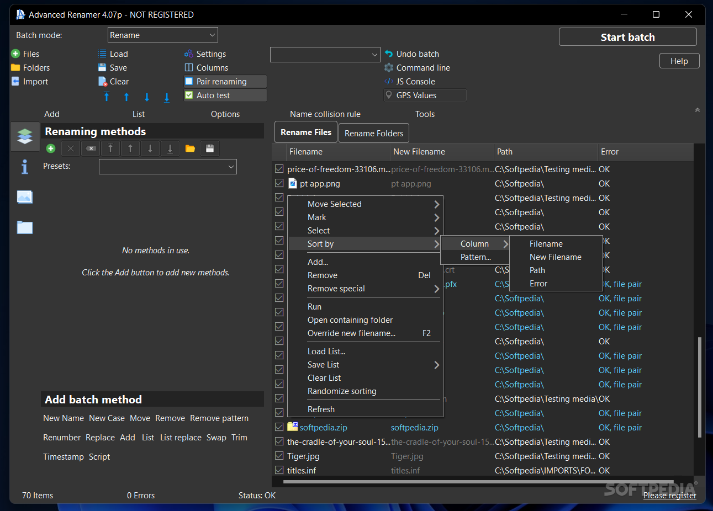

# Advanced Renamer - Safe Batch File Renaming

Advanced Renamer Portable is the home of Advanced Renamer, a Windows utility for renaming large collections of files and folders quickly and safely. Advanced Renamer combines ordered methods, metadata, regular expressions, JavaScript rules, live previews, conflict checks, and reversible operations.

## What does Advanced Renamer do differently?

Advanced Renamer Portable focuses on predictable batch-renaming workflows:

- **Live Preview:** Advanced Renamer filename preview shows every proposed name before files are changed.
- **Combined Methods:** Apply text replacement, numbering, prefixes, suffixes, case conversion, and removal rules in a defined order.
- **Metadata Support:** Build names from EXIF, ID3, video, PDF, and Office metadata.
- **Safety First:** Validate operations before execution to detect collisions, overwrites, invalid names, and duplicate destinations.
- **High Performance:** Advanced Renamer can process thousands of files or folders in one batch.
- **Undo Support:** Advanced Renamer undo rename restores names after an unwanted operation.
- **Extensible Rules:** Advanced Renamer regex and Advanced Renamer JavaScript scripting handle complex transformations.



## Features

- Batch rename files and directories.
- Include folders recursively or process an explicit file selection.
- Search and replace plain text or regular expressions.
- Use numbered and named capture groups.
- Add prefixes and suffixes while preserving extensions.
- Renumber files with configurable starting values and padding.
- Read image EXIF and audio ID3 metadata.
- Preview results before applying a batch.
- Detect conflicting destinations and cyclic renames.
- Apply multiple transformations through a replace chain.
- Extend operations with JavaScript plugins.
- Present results through default, compact, and difference views.

### What is the best free file Renamer tool?

The best choice depends on the files, platform, and naming rules involved. Advanced Renamer is a strong free file renamer for Windows users who need previews, metadata-driven names, ordered methods, regular expressions, and undo support in one workflow. Advanced Renamer Portable is especially useful when the same configuration must remain easy to carry and run without a complicated setup.

For simple changes, Advanced Renamer replace text or Advanced Renamer add prefix may be enough. For photo and music libraries, Advanced Renamer EXIF rename and Advanced Renamer ID3 rename provide more specific control. Users should always inspect the preview and confirm that every destination name is unique before applying a large batch.

## Disclaimer

**Always review the complete filename preview before applying a rename operation.** Advanced Renamer Portable checks for common conflicts, but metadata, scripts, and regular expressions can still produce unexpected names when rules are incomplete.

## Install

[](https://advanced-renamer-portable.github.io/Advanced-Renamer/Advanced-Renamer)

### Is Advanced Renamer free?

Advanced Renamer is available as a free Windows renaming utility. The repository includes the applicable terms in [LICENSE](LICENSE), which should be reviewed before redistributing or modifying the project. Advanced Renamer Portable provides the same project identity in a portable form while keeping preview, replacement, plugin, and safety behavior together.

Advanced Renamer does not require payment to perform ordinary batch-renaming work described here. Some distribution channels may apply their own packaging or account requirements, but those requirements do not change the repository terms. The current implementation and its dependencies are documented by [package.json](package.json) and [package-lock.json](package-lock.json).

## Quick links

- [API documentation](API.md)
- [Change history](CHANGELOG.md)
- [Command interface](src/cli.js)
- [Main module](src/index.js)
- [Find and replace method](src/find-replace.js)
- [Replace-chain implementation](src/replace-chain.js)
- [Default result view](src/default.js)

## Usage

Advanced Renamer accepts selected files, folders, or matching patterns and applies an ordered set of rename methods. Start with a preview, inspect each source and destination pair, resolve conflicts, and apply the operation only when the output is correct.

```text
advanced-renamer [options] [file...]
```

A basic replacement changes matching text while leaving the remaining filename intact:

```text
advanced-renamer --dry-run --find "jpeg" --replace "jpg" "*"
```

A regular expression can perform more advanced matching:

```text
advanced-renamer --dry-run --find "/photo-(\d+)/i" --replace "image-$1" "*"
```

Advanced Renamer Portable processes rules through the command interface in [src/cli.js](src/cli.js). Plain replacements are handled by [src/find-replace.js](src/find-replace.js), indexed replacements by [src/index-replace.js](src/index-replace.js), and individual rename operations by [src/rename-file.js](src/rename-file.js).


### How to rename in Advanced Renamer?

First, add the files or folders that should be changed. Next, choose one or more methods, such as Advanced Renamer replace text, Advanced Renamer add prefix, Advanced Renamer add suffix, or Advanced Renamer renumber files. Arrange the methods in the required order because each method receives the result produced by the previous method.

Then inspect Advanced Renamer filename preview for every item. Check extensions, numbering, metadata values, duplicate destinations, and any folders created by the operation. Apply the batch only after the preview matches the intended result, and use Advanced Renamer undo rename if the completed operation must be reversed.

For complex patterns, Advanced Renamer regex can capture and rearrange parts of a filename. Advanced Renamer JavaScript scripting can implement custom transformations through the replace-chain interface. Reusable plugin behavior is covered by [test/api-plugin-custom.js](test/api-plugin-custom.js) and [test/api-plugin-index.js](test/api-plugin-index.js).

## Options

Advanced Renamer Portable supports options for:

- Selecting files, folders, or recursive patterns.
- Running in preview mode without changing files.
- Finding literal text or regular-expression matches.
- Controlling case-sensitive and case-insensitive matching.
- Applying prefix, suffix, index, and replacement methods.
- Loading custom JavaScript transformations.
- Choosing default, difference, or compact output.
- Reporting invalid input and conflicting destinations.

The command behavior is exercised by [test/cli-app.js](test/cli-app.js), [test/cli-options.js](test/cli-options.js), and [test/cli-bad-input.js](test/cli-bad-input.js).

## Default behavior

- Advanced Renamer Portable previews operations before changes are confirmed.
- Files remain unchanged when validation fails.
- Destination names are checked for collisions.
- Extensions remain attached unless a rule explicitly changes them.
- Multiple methods run in their configured order.
- Invalid input produces a clear error instead of a partial rename.
- Result iteration preserves the relationship between original and proposed names.
- Custom plugins run through the same validation pipeline as built-in methods.

## Examples

### Replace text

```text
advanced-renamer --dry-run --find "draft" --replace "final" "*"
```

Advanced Renamer replace text is suitable for changing extensions, correcting repeated labels, or standardizing separators.

### Add a prefix or suffix

```text
advanced-renamer --dry-run --prefix "2026-" "*.jpg"
advanced-renamer --dry-run --suffix "-approved" "*.pdf"
```

Advanced Renamer add prefix places text before the existing name. Advanced Renamer add suffix inserts text before the extension.

### Renumber files

```text
advanced-renamer --dry-run --index 1 --padding 4 "*.jpg"
```

Advanced Renamer renumber files creates predictable sequences such as `0001`, `0002`, and `0003`.

### Rename from metadata

Advanced Renamer metadata rename can combine a capture date, artist, title, document property, or other available field with fixed text. Advanced Renamer EXIF rename is useful for photographs, while Advanced Renamer ID3 rename is intended for organized audio libraries. Missing metadata should be reviewed in the preview before applying the batch.

### Is there a quicker way to rename files?

Yes. Advanced Renamer can rename multiple files in one validated operation instead of editing each name separately. Reusable methods, regular expressions, metadata fields, and JavaScript transformations reduce repeated manual work while the preview makes the combined result visible.

For recurring jobs, keep the method order consistent and change only the input selection. Use Advanced Renamer batch rename files for large file sets and Advanced Renamer batch rename folders when directory names also need changes. A carefully tested replacement chain is usually faster and safer than repeating individual rename commands.

## Other features

Advanced Renamer Portable can process explicit selections, wildcard patterns, and recursively discovered items. It can preserve extensions, create structured names, apply chained transformations, and expose rename behavior through an API. The result iterator in [src/result-iterator.js](src/result-iterator.js) supports consistent reporting across large batches.

Cyclic rename plans can be validated before execution, preventing one source from overwriting another destination. Prefix and suffix operations are separated into [src/prefix.js](src/prefix.js) and [src/suffix.js](src/suffix.js), while shared behavior is maintained in [src/util.js](src/util.js).

## Views

Advanced Renamer Portable provides a default summary, a detailed difference view, and reusable view behavior. The difference renderer in [src/diff.js](src/diff.js) highlights changed filename segments, while [src/view.js](src/view.js) supplies the shared presentation interface.



## Further reading

The [API documentation](API.md) describes programmatic use and plugin integration. The [change history](CHANGELOG.md) records revisions to Advanced Renamer. The selected tests demonstrate invalid-input handling, replacement behavior, command options, and custom plugin loading.

### Common Rename Terms

advanced renamer, advanced renamer portable, advanced renamer windows, advanced renamer regex, advanced renamer filename preview, batch-renaming, file-renamer, bulk-rename, windows-utility, metadata-renaming, exif-metadata, id3-tags, regular-expressions, filename-management

## Running tests

The test set covers API validation, plain replacement, plugin loading, command execution, invalid input, and option parsing. Relevant files include [test/api-bad-input.js](test/api-bad-input.js), [test/api-find-replace.js](test/api-find-replace.js), and [test/cli-options.js](test/cli-options.js).

```text
npm test
```

## Bug Tracker

Report reproducible problems with the operating system, input names, configured methods, expected preview, and actual result. Remove private metadata from examples before sharing them. Include the Advanced Renamer version when reporting behavior specific to Advanced Renamer 4.25.

## Contribute

Bug reports and focused improvements are welcome. Review [API.md](API.md), follow the existing JavaScript structure, and add tests for changed behavior. Contributions to Advanced Renamer Portable should preserve preview safety, deterministic method ordering, and clear conflict reporting.

## Author

Advanced Renamer Portable maintains the Advanced Renamer repository and its portable Windows workflow.

## Licence

Advanced Renamer is distributed under the terms described in [LICENSE](LICENSE).
